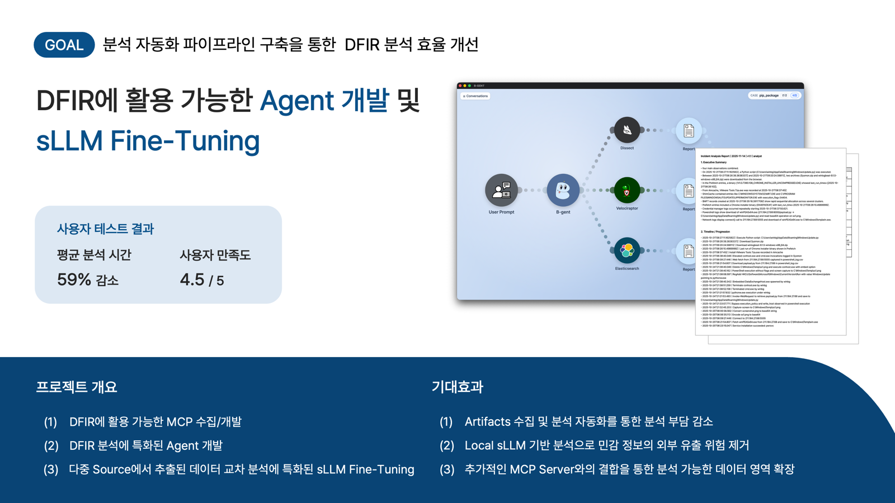
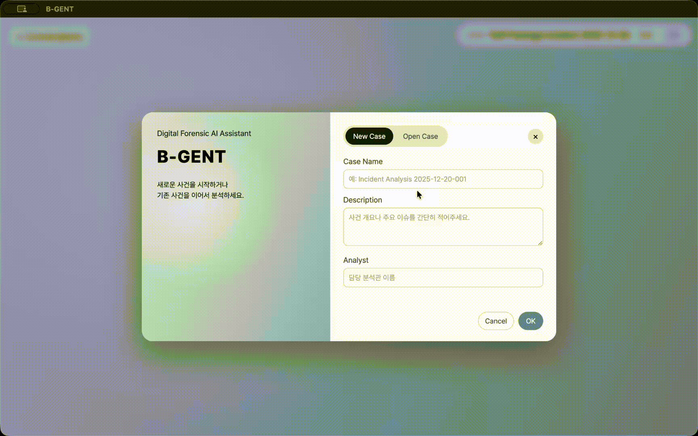

  <h1>B-gent</h1>
  <h3>DFIR 분석에 활용 가능한 Agent 개발 및 sLLM Fine-Tuning</h3>

 

  

---

## 개요
- **프로젝트명:** B-gent
- **프로젝트 기간:** 2025.09 ~ 2025.12.20
- **프로젝트 형태:** Best of the Best 14th 디지털 포렌식 트랙 2단계 프로젝트
- **팀원:** 나소진, 고세이, 김희정, 반영진, 이광호, 이민지
- **목표:** 분석 자동화 파이프라인 구축을 통한 DFIR 분석 효율 개선
- **주요 타겟 사용자:** 초보 분석가 및 초기 분석 단계를 편하게 넘기고 싶은 전문 포렌식 분석관

---

## 주요 기능
### 1. Client App을 통한 프롬프트 입력

  

- 지정 경로를 통해 파일명으로 자동 인식
- 텍스트로 입력된 데이터 및 xml, csv, json, jsonl 파일에 대한 전처리
- 노드형 UI를 통한 직관적인 흐름 이해

### 2. Agent를 통한 파일 내 증거 수집

  

- 13종의 MCP Server 연결을 통한 기본 아티팩트 수집
- Hybrid Planning 구조를 통해 MCP Server 사용 정확도 향상
- 각 활동에 특화된 프롬프트 적용을 통해 정확도 향상 및 Context 효율화

### 3. 교차분석 sLLM을 통한 다중 소스 증거 분석

  

- Chunking을 통한 대용량 데이터 단일 처리 부담 완화 및 분석 집중도 향상
- 재검증 단계를 통해 분석 데이터의 신뢰성 강화 및 정확도 향상

## 기술 스택
<table>
  <thead>
    <tr>
      <th>분류</th>
      <th>기술 스택</th>
    </tr>
  </thead>
  <tbody>
    <tr>
      <td>Frontend</td>
      <td>
        
        
        
        
        
      </td>
    </tr>
    <tr>
      <td>Backend</td>
      <td>
        
        
      </td>
    </tr>
    <tr>
      <td>Database</td>
      <td>
        
      </td>
    </tr>
    <tr>
      <td>Agent</td>
      <td>
        
      </td>
    </tr>
    <tr>
      <td>Infra</td>
      <td>
        
      </td>
    </tr>
  </tbody>
</table>